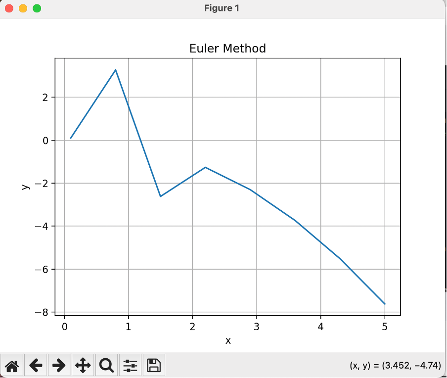

---

# 📊 **Numerical Computing Assignment**  

Welcome to the repository for **Assignment #1** of the **Numerical Computing** course (Spring 2024). This assignment dives into core computational methods like **root-finding**, **solving ODEs**, and **data interpolation**, providing both theoretical insights and practical implementations.  

---

## 📑 **Contents**  

### 🧮 **Part 1: Differential Equations and Numerical Methods**  
1. **Newton-Raphson Method**  
   - Solves algebraic and transcendental equations.  
   - Includes an example to find all roots of a given equation.  

2. **Ordinary Differential Equations (ODEs)**  
   - **Exact Solution**: Analytical methods to derive the solution.  
   - **Numerical Methods**:  
     - **Euler's Method**.  
     - **Runge-Kutta Method (Order 4)**.  
   - Visualization of solutions and interpolation for additional insights.  

3. **System of First-Order ODEs**  
   - Solved using the **Runge-Kutta Method (Order 4)**.  

4. **Second-Order ODEs**  
   - Addressed with the **Runge-Kutta Method (Order 4)**.

---

### 📈 **Part 2: Interpolation and System of Equations**  
1. **Cubic Spline Interpolation**  
   - Applied to data in `bps.dat`.  
   - Visualized with smooth, intuitive plots.  

2. **Explicit Solution for Systems of Equations**  
   - Derive analytical expressions for \(x\), \(y\), and \(z\) from a given system.  

3. **Population Estimation**  
   - Estimate growth trends using **Newton's Backward Interpolation Formula** and census data.  

---

## 📂 **Repository Contents**  

- **`solutions.py`**: Python script containing:  
  - Numerical method implementations.  
  - Visualization code.  
  - Comments explaining sample questions.  
- **`bps.dat`**: Dataset for cubic spline interpolation.  

---

## 🚀 **How to Run the Project**  

1. **Install Dependencies**  
   Ensure you have the required Python libraries installed:  
   ```bash
   pip install matplotlib numpy scipy
   ```  

2. **Execute the Script**  
   Run the program to compute and visualize results:  
   ```bash
   python solutions.py
   ```  

---

## 🎯 **Key Highlights**  

- **Modular Design:** Each method is implemented in a separate, reusable function.  
- **Visualization:** Clear plots for ODE solutions, interpolation, and more.  
- **Comprehensive Coverage:** From single-variable to system-level numerical computations.  

---

## 📊 **Preview of Plots**  
Here are a few examples of what you’ll see:  
1. **ODE Solution Plots** (Euler vs. RK4).  
2. **Cubic Spline Interpolation Curve**.  



*Figure 1: ODE Solution - Euler Method.*


*Figure 2: ODE Solution - RK4 Method.*


*Figure 3: Cubic Spline Interpolation.*
  

---

## 💡 **Learning Outcomes**  
By exploring this repository, you will:  
1. Strengthen your understanding of numerical techniques.  
2. Learn practical applications of methods like RK4, Newton-Raphson, and interpolation.  
3. Develop skills to visualize and analyze computational solutions.  

---  

Happy Coding! 🚀  

---
